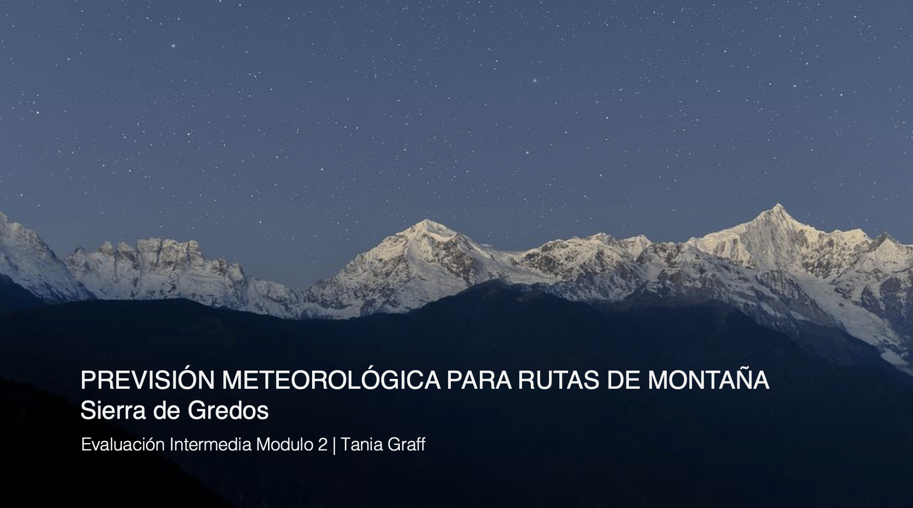

# Evaluacion Intermedia Modulo 2
**Tania Graff**| Promo A Part Time

Previsión metereológica para rutas de montaña - Sierra de Gredos

**Web scraping** 
- Previsión metereológica: Extracción de la temperatura máxima y mínima para la Sierra de Gredos utilizando la API AEMET.
- Rutas Montaña: Extracción de las principales rutas de montaña por la Sierra de Gredos de esta página web [link_pagina](https://turismoactiva.com/rutas-de-montana-sierra-de-gredos/), utilizando la librería Beautiful Soup.

**Creación de tablas en SQL** 
Creación de dos tablas para almacenar los datos extraídos con Beautiful Soup y API's.

